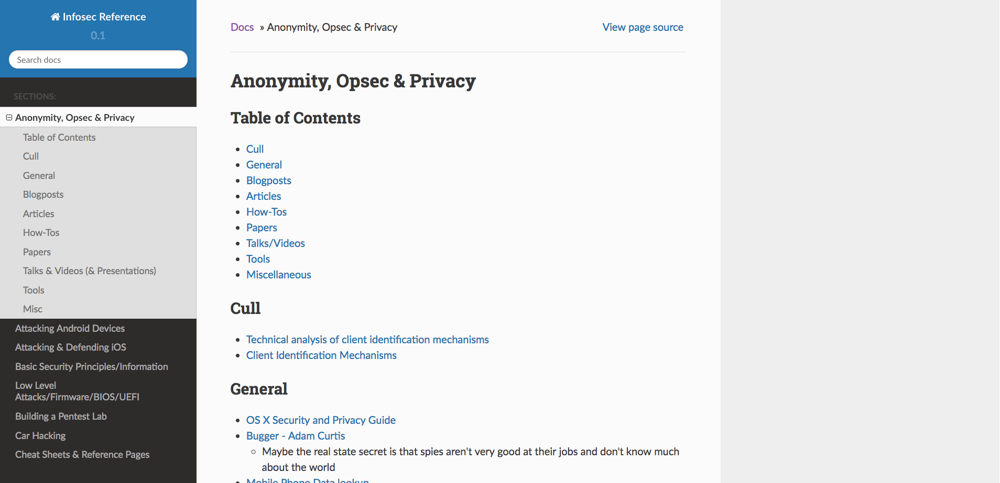

# Infosec Reference

## Goals:

* Create an awesome Information Security reference
* To have a comprehensive list of techniques, tools and tactics to learn from/reference.
  * Something like a "Yellow Pages" in the sense of you know something exists, but what was it called....
* End goal: Have a rich resource of information security knowledge for anyone to browse through as a jumping off point for various niches OR as a reference/recall method for stuff.
* Something oppposite to the [MITRE ATT&CK Framework](https://attack.mitre.org/wiki/Main_Page) 
  * For example, "I want to do priv esc on OS X/windows/linux, what methods are there?" or, "I need to do X under Y situation". Focus is on attacks and how they're done vs how attacks are done with a focus on defense.
* I'm always accepting more links/stuff. Feel free to contribue or suggest something.

## Screenshots

#### Landing page


#### Sample page


### Why Do *I* Care?

* I created this as a resource for myself and to offer it publicly as a way of giving back to the general community.
* To be clear, these aren't personal notes. I keep this repository maintained as a way of having pointers to information that I feel will help build someone's skill set or increase understanding of attacks/methods/defenses.

### Why Do *You* Care?

* You won't have to constantly google for tools/reminder
* It's an easily browseable list of tools, techniques, papers, and research in all sorts of areas
* You want to read some good info

## Installation

* Install `Python 3`
* Run the terminal command `pip install -r requirements.txt` to install the dependencies for Sphinx
* Install `yarn`
* Run the `yarn` to install the dependencies for `prettier`

## Website Build Commands

To render the Markdown and reStructuredText into HTML, run the terminal command `make html` from the `sphinx/` folder. 
This will render and output the website to the `build/html/` folder.

To lint your Markdown run `yarn run pretty`. At the moment, this only lints single files. You can lint entire directories using a command like this `find ./src/**/*.js | xargs prettier --write --print-width 80 --single-quote --trailing-comma es5`. More information can be [found here](https://til.hashrocket.com/posts/498b012fbd-run-prettier-on-all-javascript-files-in-a-dir).

## Website Settings

To edit the settings, change the `source/conf.py` file.

## Mobile Development

The Android version of this application is build using `react-native`. To get started, run the following commands:

1. `npm install -g create-react-native-app`
2. `cd MobileApplication`
3. `npm start`
4. Scan the QR code in the `Expo` app
5. Start developing!

A more detailed set of instructions for setting up can be found on the [React-Native website](https://facebook.github.io/react-native/docs/getting-started.html).

To be able to view the application on your phone while you're developing, you must use the Expo client.

* Android client can be found here [here](https://play.google.com/store/apps/details?id=host.exp.exponent).
* iOS client can be found [here](https://itunes.apple.com/us/app/expo-client/id982107779?mt=8).

## Structure 

Helpful notes:
* Use two spaces for indentation
* Use # for the page title

Pages should have the following structure:

```markdown
# <title>

## <table of contents>

## <section header>

* bullet point
* bullet point

  * sub-bullet point
  
* bullet point

Normal text looks like this

[Link title](the actual link goes here)

```

## Seeing the latest updates

* For latest content updates, [check the reposity](https://github.com/rmusser01/Infosec_Reference/blob/master/Draft/things-added.md).
